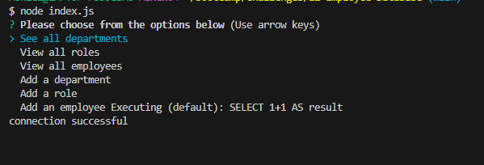

# 12-Employee-Database

## Description

## Table of Contents (Optional)

- [Installation](#installation)
- [Usage](#usage)
- [Credits](#credits)
- [License](#license)

## Installation
Run the following commands in your terminal to install all the needed packages to run this app:
1. npm -y
2. Install inquirer (npm install inquirer@8.2.4)
2. Install SQL (npm install mysql2)
3. Install Sequelize (npm sequelize)

Once all the packages are installed,
Run the following command to start mySQL: mysql -u root -p and log in with your SQL credentials

## Usage

Once all the packages are installed,
Run the following command to start mySQL: mysql -u root -p and log in with your SQL credentials, then you can close out SQM by typing command quit
Run command node index.js, this will start the application by running the app's prompts
Select the option that best meets your needs from the drop down list

    

    

Repo link: https://github.com/Volcomix13/12-Employee-Database
## License
Please see repository for license info.